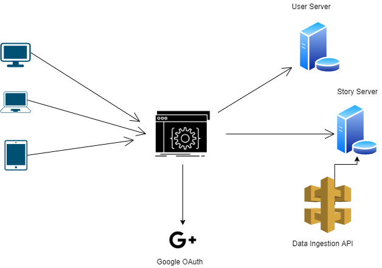

# pratilipi_book_assignment
## Project Details

This Project is all about creating a blogging web-app with serving books as content, which will have a title and a story. I have also created a testing API, which will help us ingest csv data into the database. Story Database has title, story, date and user ID and User Database has Login details fetched using Google Oauth2.0 and Google Cloud Console API. After user details are fetched it's uploaded to User Database in Mongo Atlas. After successful sign-in user can post stories and it will be stored in another database called Story.

## Database Model

### Pratillipi Assignment **Table: `User`**

- `googleId` it is the primary key in User is used to identify users and also acts as the foreign key between two databases.
- `firstName, lastname` is used to store the user's full name.
- `email` is used to store email id for the security of the user.
- `image` it is used to fetch and store images from their google id
- `createdAt` is used to store the date and time of creation of an entity.

### Pratillipi Assignment **Table: `Story`**

- `title` is used to store the story title
- `body` is used to store the story
- `status` whether to publish the story or to keep it private
- `User` Connects the Story table to User table, so that only signed up user can publish stories.
- `createdAt` is used to store the date and time of creation of an entity.

### Database Ingestion API table: `content.model`,`dummy.model`, `file.model`

These all are separate clusters in Ingestion Database. 

## High Level Design



## Installation for Node App

### **Installation**

Please follow the below steps to recreate on the localhost

```python
git clone gh repo clone abhinavprkash/pratilipi_book_assignment

cd pratilipi_book_assignment

npm install

npm run dev
```

### Running the docker image for web-App

After cloning the repo and installing the node image in docker. 

- Start

    ```python
    #[For Development]
    docker-compose -f docker-compose.yml -f docker-compose.dev.yml up -d --build 
    #[For Production]
    docker-compose -f docker-compose.yml -f docker-compose.prod.yml up -d --build 
    ```
- open the browser
    ```
    visit http://localhost:5000
    ```
- Stop

    ```python

    #[For Development]
    docker-compose -f docker-compose.yml -f docker-compose.dev.yml down -v 
    #[For Production]
    docker-compose -f docker-compose.yml -f docker-compose.prod.yml down -v 
    ```
## Testing API Docs

Testing API is used to ingest CSV data into the DB. 

### To Run The Server in local system

```bash

git clone https://github.com/abhinavprkash/pratillipi-testing-api

cd pratillipi-testing-api

npm install

node server.js
```

## Endpoint To Upload a CSV File

URI: [`http://localhost:8080/api/main/uploadFile`](http://localhost:8080/api/main/uploadFile)

Request Type: `POST`

Body: (In postman)


## Endpoint To Populate DB

URI: [`http://localhost:8080/api/main/test`](http://localhost:8080/api/main/test)

Request Type: `GET`

Body: NA